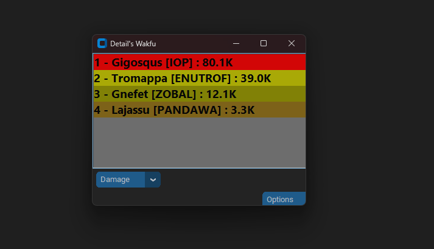
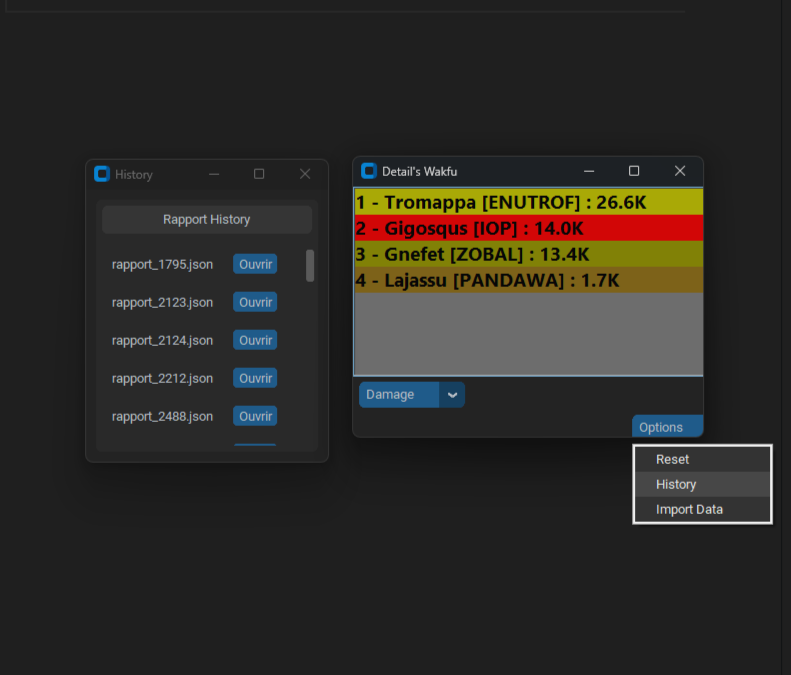

# 🐉 Detail's Wakfu

**Detail's Damage Meter for Wakfu**  
Outil de comptage des dégâts développé en **Python** pour le jeu **Wakfu**, édité par **Ankama Games**.  
L’application fonctionne entièrement grâce à la lecture des **logs du jeu**.

---

## 📚 Sommaire
- [Aperçu](#-aperçu)
- [Etat-Actuel](#-Etat-Actuel)
- [Limitations](#-limitations)
- [Fonctionnement](#-fonctionnement-global)
- [Exécutable](#-exécutable)
- [Open Source](#-open-source)
- [Effets indirects](#-effets-indirects)
- [Historique](#-Historique)

---

## 🖼️ Aperçu

---

## Etat-Actuel 

actuellement les degats/heals/shields direct (dans le tour en cours) sont completement pris en compte 

les classes suivante n'ont pas encore leurs effets passif integré et testé 
-osamodas
-steamer 

le reste des classes est soit completement geré soit en progression 
Ce travaille demande du temps, un acces aux classes et une certaine connaissances de celle-ci, ce que je n'ai pas forcement, il est donc possible que certain oublis ou meconnaissance de ma part soit encore present

## 🔒 Limitations
la pluspart des glyphes posé au sol ne peuvent pas etre tracker comme il le faut car aucun indicateurs n'est present dans le chat (voir section [Effets indirects](#-effets-indirects)).

voici une liste detaillé de tous les effets que je n'arrive pas encore a tracker : 
- Ne fonctionne pas en **PvP** (impossible de distinguer Alliés / Ennemis).  
- Ne fonctionne pas avec les **glyphes Féca**.
- Ne fonctionne pas avec la glyphe nature morte de l'eniripsa.
- Ne fonctionne pas avec le **passif Pucif** de l’Écaflip (voir section [Effets indirects](#-effets-indirects)).
- Ne fonctionne pas avec les degats de la Trainée de Wakfu poser par le sort **Flux torrentiel** de l'eliotrope
- Ne fonctionne pas avec le heal du **passif Protecteur du troupeau** Feca
- Ne fonction pas avec les degats du **passif Mur de poudre** du roublard
- Ne fonctionne pas avec es degats de la **Marque Letal** du double sram
- Les **réanimations** n’affichent pas de valeur dans les logs.

---

## ⚙️ Fonctionnement global

⚠️ **Attention :** si vous lancez l’application **après** être entré en combat, le combat en cours **ne sera pas enregistré**.  

⚠️ **Attention :** Les degats sur alliés sont desactivé

Le programme lit le fichier de logs du jeu, généralement situé à l’adresse suivante :  
``"C:\Users\{$USER}\AppData\Roaming\zaap\gamesLogs\wakfu\logs\wakfu.log"`` 
en ne considérant **que les lignes commençant par** `INFO`.

---

Lors du lancement d’un combat, l’application détermine les joueurs présents grâce à une ligne du type :

``INFO 19:42:03,301 [AWT-EventQueue-0] (eNh:1402) - [_FL_] fightId=1552274103 Sosasna breed : 7 [11074238] isControlledByAI=false obstacleId : -1 join the fight at {Point3 : (0, -13, 0)}`` 

Cette ligne contient :
- le **nom du joueur**  
- la **classe**  
- et l’information **controlled_by_AI**

---

Ensuite, l’application parcourt toutes les lignes suivantes :

- `lance le sort` → détermine le joueur actif (le tour en cours), ou `None` si aucune correspondance n’est trouvée.  
- `PV` → traite les **dégâts** ou les **soins** effectués par le joueur actif (exceptions pour les effets indirects, voir section [Effets indirects](#-effets-indirects)).  
- `Armure` → traite les **boucliers/armures** accordés par le joueur actif (exceptions également pour les effets indirects).

--- 

## 💾 Exécutable

Vous pouvez télécharger la version exécutable à l’adresse suivante :  
pas encore disponible 

## Open-Source

!actuellement l'application est prevu pour tourner sur windows avant tout!

`LINUX`
1. Cree votre environnement virtuel python 
`python3 -m venv .venv`

2. activer l'environnement virtuel 
`source .venv/bin/activate`

3. Installer les paquets (pip)
`pip install -r requirementsW.txt`

4. Lancer le programme 
`python3 src/monitor2.py`

`WINDOWS`
1. Cree votre environnement virtuel python 
`python -m venv .venv`

2. activer l'environnement virtuel 
`.venv\Scripts\Activate.ps1` ou `.venv\Scripts\activate.bat`

3. Installer les paquets (pip)
`pip install -r requirementsW.txt`

4. Lancer le programme 
`python src/monitor2.py`

## 🔁 Effets indirects

Les dégâts ou effets indirects sont actuellement gérés grâce à la dernière parenthèse de chaque ligne du log, qui indique généralement le nom de l’effet concerné, par exemple :
`Sac a Patate: -488 PV (Eau) (Sablier)`

Font partie de cette catégorie tous les sorts infligeant des dégâts, soins ou boucliers en dehors du tour du lanceur du sort.

Le programme s’appuie sur un référencement des effets de toutes les classes afin d’identifier la classe d’origine de l’effet.

Cependant :

Les glyphes de maniere génerale et les heal du passif 'Pucif' de l’Écaflip,
ne peuvent actuellement pas être associés correctement à leur source.

Cela peut egalement poser des problèmes d’attribution lorsque plusieurs instances d’une même classe sont présentes dans un combat.

## 🕓 Historique

Actuellement, l’application permet d’afficher l’historique des anciens combats trié dans l'ordre du plus recent en premier via un menu accessible depuis le bouton **Options**.

Un boutton Toggle est disponible pour detailler les monstres affrontés 
et un boutton Ouvrir est disponible pour revoir dans le details le combat en question