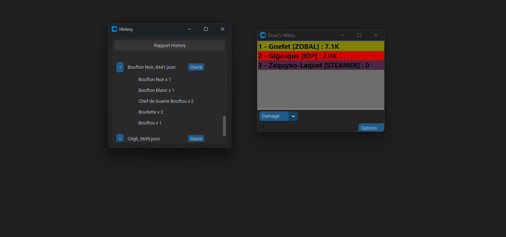

# 🐉 Detail's Wakfu

**Detail's Damage Meter for Wakfu**  
Outil de comptage des dégâts développé en **Python** pour le jeu **Wakfu**, édité par **Ankama Games**.  
L’application fonctionne entièrement grâce à la lecture des **logs du jeu**.

---

## 📚 Sommaire
- [Aperçu](#-aperçu)
- [Limitations](#-limitations)
- [Fonctionnement](#-fonctionnement-global)
- [Exécutable](#-exécutable)
- [Open Source](#-open-source)
- [Effets indirects](#-effets-indirects)
- [Historique](#-Historique)

---

## 🖼️ Aperçu

---

## 🔒 Limitations

- Ne fonctionne pas en **PvP** (impossible de distinguer Alliés / Ennemis).  
- Ne fonctionne pas avec les **glyphes Féca** (voir section [Effets indirects](#-effets-indirects)).  
- Ne fonctionne pas avec le **passif Pucif** de l’Écaflip (voir section [Effets indirects](#-effets-indirects)).  
- Les **réanimations** n’affichent pas de valeur dans les logs.

---

## ⚙️ Fonctionnement global

⚠️ **Attention :** si vous lancez l’application **après** être entré en combat, le combat en cours **ne sera pas enregistré**.  

Le programme lit le fichier de logs du jeu, généralement situé à l’adresse suivante :  
``"C:\Users\{$USER}\AppData\Roaming\zaap\gamesLogs\wakfu\logs\wakfu.log"`` 
en ne considérant **que les lignes commençant par** `INFO`.

---

Lors du lancement d’un combat, l’application détermine les joueurs présents grâce à une ligne du type :

``INFO 19:42:03,301 [AWT-EventQueue-0] (eNh:1402) - [_FL_] fightId=1552274103 Sosasna breed : 7 [11074238] isControlledByAI=false obstacleId : -1 join the fight at {Point3 : (0, -13, 0)}`` 

Cette ligne contient :
- le **nom du joueur**  
- la **classe**  
- et l’information **controlled_by_AI**

---

Ensuite, l’application parcourt toutes les lignes suivantes :

- `lance le sort` → détermine le joueur actif (le tour en cours), ou `None` si aucune correspondance n’est trouvée.  
- `PV` → traite les **dégâts** ou les **soins** effectués par le joueur actif (exceptions pour les effets indirects, voir section [Effets indirects](#-effets-indirects)).  
- `Armure` → traite les **boucliers/armures** accordés par le joueur actif (exceptions également pour les effets indirects).

--- 

## 💾 Exécutable

Vous pouvez télécharger la version exécutable à l’adresse suivante :  
pas encore disponible 

## Open-Source

!actuellement l'application est prevu pour tourner sur windows avant tout!

1. Cree votre environnement virtuel python 
`python3 -m venv .venv`

2. activer l'environnement virtuel 
`source .venv/bin/activate`

3. Installer les paquets (pip)
`pip install -r requirementsW.txt`

4. Lancer le programme 
`python3 src/monitor2.py`

## 🔁 Effets indirects

Les dégâts ou effets indirects sont actuellement gérés grâce à la dernière parenthèse de chaque ligne du log, qui indique généralement le nom de l’effet concerné, par exemple :
`Sac a Patate: -488 PV (Eau) (Sablier)`

Font partie de cette catégorie tous les sorts infligeant des dégâts, soins ou boucliers en dehors du tour du lanceur du sort.

Le programme s’appuie sur un référencement des effets de toutes les classes afin d’identifier la classe d’origine de l’effet.

Cependant :

Les glyphes du Féca,
Et le passif Pucif de l’Écaflip,
ne peuvent actuellement pas être associés correctement à leur source.

Cette liste pourra s’allonger avec les futures mises à jour.
Cela peut poser des problèmes d’attribution lorsque plusieurs instances d’une même classe sont présentes dans un combat.

## 🕓 Historique

Actuellement, l’application permet d’afficher l’historique des anciens combats via un menu accessible depuis le bouton **Options**.

Pour le moment, les anciens rapports sont générés avec des valeurs aléatoires, mais j’ai déjà prévu de **refondre l’affichage** afin d’attribuer à chaque rapport le **nom des monstres** présents dans le combat, ainsi que d’ajouter la possibilité de **visualiser tous les ennemis** rencontrés.  
Cela permettra de **distinguer facilement les combats contre les boss** et autres affrontements.
